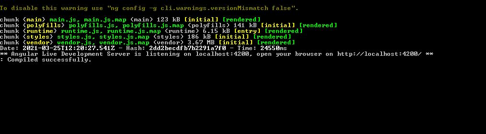

ADELEKE DTO APP
==============

### About App
This App is to demonstrate my deep understanding of Angular framework and how to work with many of its components and features to build a scalable and world standard application

### Installation

### App Dependencies
Please make you have the following running on your system, before running this app:

1. Node and NPM
2. Angular 9+
3. Typscript

### Step 1

In your gitbash clone this app with:

```
git clone https://github.com/lekzy2088/Adeleke-DTO.git

```

### Step 2
Install dependencies with:

```
npm install
```
### Step 3
After successful installation, run the app with

```
ng serve
```

